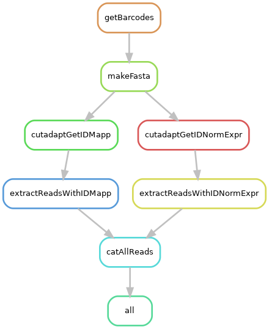

## TRIP-WIRE Test Data Generation Script

This directory will generate test data `test_R1.fastq.gz` and `test_R2.fastq.gz`
files from a full TRIP experiment. These test files will contain only reads
from chromosome 19 identified in the normalization, expression, and
mapping libraries. The small size of the test data allows for downstream
analyses to run quickly and are designed for CI/CD testing of TRIP analysis
software.

This test extracts chr19 barcodes from the normalization, expression, and
mapping library from the either the original TRIP Perl script or the TRIP-wire
pipeline. The test dataset is built from 2 pools/experiments for 2 conditions
with 2 technical replicates each. See below for configuration details.

The data are included in this repository and are the primary output. The code
in the repository and the instructions below are for re-generating test data --
perhaps from a different kind of experiment or different organism, or using
different parameters.

Here is a DAG (directed acyclic graph) of the workflow:



## Running the workflow

1) Clone this directory using `git clone https://github.com/NICHD-BSPC/trip-wire-test-data`

2) With [conda installed](https://docs.conda.io/projects/conda/en/latest/user-guide/install/index.html) and the [Bioconda channel set up](https://bioconda.github.io/), build and create a conda environment using `mamba create -p ./env --file requirements.txt`

3) Activate the environment using `conda activate ./env`

4) Set up your input data. Data must go in `full_dataset` and `fastq` as follows:

**`full_dataset`**

This includes two subdirectories, `trip_output` and `demux_data`.

`trip_output` has one directory for each pool/techrep/condition combination,
and inside that directory is a single file, `final_TRIP_data_table.txt`. The
contents of those files look like this:

```
barcode           norm   exp_1  chr_f  ori_f  pos_f      reads_f  mapq_f  freq1_f  freq2_f  chr_r  ori_r  pos_r      reads_r  mapq_r  freq1_r  freq2_r
GATTTAGTCGCTCTCG  22249  37891  *      4      [0](2024-07-30_0.md)          8942     0.00    0.208    0.156    chr5   -      48504758   8830     39.02   0.394    0.247
TTGGTGGTGTAAGGGA  18845  10945  chr8   +      60954656   29617    34.61   0.193    0.161    chr8   -      60954872   29446    43.92   0.314    0.180
AATACAAATCGTGGAA  16780  6067   *      4      0          7486     0.00    0.208    0.179    *      4      0          7393     2.50    0.286    0.147
```

`demux_data` must have one fastq file for each of the pool/techrep/condition
combinations above, but also R1 and R2 for each, and also each library type
(mapping, normalization, and expression).

The following filename formats are expected:

* **Mapping:** `demux_data/pool{pool}_{condition}_{library}_{read}.fastq.gz`
* **Expression:** `demux_data/pool{pool}_techrep{techrep}_{condition}_{library}_{read}.fastq.gz`
* **Normalization:** `demux_data/pool{pool}_techrep{techrep}_{condition}_{library}_{read}.fastq.gz`

**`fastq`**

This directory must contain two files, `Undetermined_R1.fastq.gz` and
`Undetermined_R2.fastq.gz`. These are the full, still-multiplexed fastq files
from which the data in `full_dataset/demux_data` was generated.

For example, the directory with the files from this repository, plus the conda
environment, and all input data would look something like this for a situation
with R1 and R2, conditions "treatment" and "control", two pools "a" and "b",
and two technical replicates for each, "1" and "2":

```
.
├── env
├── requirements.txt
├── Snakefile
├── full_dataset
│   ├── trip_output
│   │   ├── poola_techrep1_treatment
│   │   │   └── final_TRIP_data_table.txt
│   │   ├── poola_techrep1_treatment
│   │   │   └── final_TRIP_data_table.txt
│   │   ├── poola_techrep1_control
│   │   │   └── final_TRIP_data_table.txt
│   │   ├── poola_techrep2_treatment
│   │   │   └── final_TRIP_data_table.txt
│   │   ├── poola_techrep2_control
│   │   │   └── final_TRIP_data_table.txt
│   │   ├── poolb_techrep1_treatment
│   │   │   └── final_TRIP_data_table.txt
│   │   ├── poolb_techrep1_control
│   │   │   └── final_TRIP_data_table.txt
│   │   ├── poolb_techrep2_treatment
│   │   │   └── final_TRIP_data_table.txt
│   │   └── poolb_techrep2_control
│   │       └── final_TRIP_data_table.txt
│   └── demux_data
│       ├── poola_treatment_mapping_R1.fastq.gz
│       ├── poola_control_mapping_R1.fastq.gz
│       ├── poola_techrep1_treatment_expression_R1.fastq.gz
│       ├── poola_techrep1_treatment_normalization_R1.fastq.gz
│       ├── poola_techrep1_control_expression_R1.fastq.gz
│       ├── poola_techrep1_control_normalization_R1.fastq.gz
│       ├── poola_techrep2_treatment_expression_R1.fastq.gz
│       ├── poola_techrep2_treatment_normalization_R1.fastq.gz
│       ├── poola_techrep2_control_expression_R1.fastq.gz
│       ├── poolb_techrep2_control_normalization_R1.fastq.gz
│       ├── poolb_treatment_mapping_R1.fastq.gz
│       ├── poolb_control_mapping_R1.fastq.gz
│       ├── poolb_techrep1_treatment_expression_R1.fastq.gz
│       ├── poolb_techrep1_treatment_normalization_R1.fastq.gz
│       ├── poolb_techrep1_control_expression_R1.fastq.gz
│       ├── poolb_techrep1_control_normalization_R1.fastq.gz
│       ├── poolb_techrep2_treatment_expression_R1.fastq.gz
│       ├── poolb_techrep2_treatment_normalization_R1.fastq.gz
│       ├── poolb_techrep2_control_expression_R1.fastq.gz
│       └── poolb_techrep2_control_normalization_R1.fastq.gz
└── fastq
    ├── Undetermined_R1.fastq.gz
    └── Undetermined_R2.fatq.gz
```
4) Optionally edit the following parameters in the `Snakefile`, and ensure that
   the filenames in the input directory have the right corresponding pattern.

| Parameter Name | Example                                      | Need to Modify? | Description                                                                                                                                                      |
|----------------|----------------------------------------------|-----------------|------------------------------------------------------------------------------------------------------------------------------------------------------------------|
| `pool`         | `['a', 'b', 'c', 'd']`                       | Yes             | Names of the pools/experiments. Designate as many pools/experiments you want to analyze.                                                                         |
| `techrep`      | `['1', '2']`                                 | Yes             | Number of technical replicates provided. Designate as many technical replicates you have.                                                                        |
| `condition`    | `['treatmentA', 'treatmentB', 'control']`    | Yes             | Condition naming convention. Designate as many conditions you have.                                                                                              |


5) Run the Snakefile using `snakemake -j <N>` where `<N>` is the number of cores to provide.

#### Data Outputs

The expected output will be found in **`results/test_R1.fastq.gz`** and **`results/test_R2.fastq.gz`**.

## Understanding the Snakefile

The rules within the Snakefile will do the following:

**1) getBarcodes:** Extracts all the barcodes from each of the trip output's full, demultiplexed
'final table', and pulls only lines (barcodes) that have Chr19.

`processing/barcodes_poola.txt`:

```
AAAATCTAGGAGCCCA
AAAATCTGCCTCTTAC
AAAATTCATAGCAGCA
```

**2) makeFasta:** Changes the file type from a list of barcodes to a fasta format.

`processing/barcodes_poola.fasta`:
```
>0
AAAATCTAGGAGCCCA
>1
AAAATCTGCCTCTTAC
>2
AAAATTCATAGCAGCA
```

Note that different pools can share a small number of barcodes. If we were to
look for a chr19 barcode from pool A directly in the full (still-multiplexed)
dataset, we might find pool B reads with that barcode but they will not
necessarily be mapped to chr19.

So we look for barcodes in a pool-specific manner, using the demultiplexed fastq files.


**3) cutadaptGetIDMapp:** Extract the readIDs matching chr19 barcode using Cutadapt for the mapping library.

Example of output files:

`r1cutadapt_mapping_poola_treatment.fastq`:

```
    @A01256:215:HGKNKDRX2:1:2101:9019:1517 1:N:0:0
    ACTGTACAGTGTCACAAGGGCCGGCCACAACTCGAGTGACTAGTAAAGTAACTGATCTATGCCTCGCTTCACTGACTACTTACCATAGGCACCAAGAGGCA
    +
    FFF,FFFF:F:FFF,,F,:FF,FFFFF:,FFF:FFFFFFFFF:,:FFFFF:FF,FFF:::,,FF:F,FF,F:FF:::FFF,,:FFFFF,,:F,:FFF,,FF
    @A01256:215:HGKNKDRX2:1:2101:3640:3067 1:N:0:0
    ACTGTACAGTGTCACAAGGGCCGGCCACAACTCGAGTAACCTGTTGTGCGACTGATCACAAGCAACACAAACACAGACCTATAGACACACAGAACACAGAC
    +
    FF:,FFFFFFFF:F:FFF,FF:FFF:,,,,F:,FFF:F:FFF,:,:FFFF:F:F,F,:FF:FFFFFF:F,:,,F,,FF,:F::F:FF:F:F:F,F:F,::,
```

`readID_mapping_poola_treatment.txt`:
```
    A01256:215:HGKNKDRX2:1:2101:9019:1517
    A01256:215:HGKNKDRX2:1:2101:3640:3067
```

*Note: the _1:N:0:0 is chopped off because seqtk cannot handle whitespaces.*

**4) ExtractReadsWithIDMapp:** Using the read IDs from above, extract the full read from the full still-multiplexed dataset for the mapping library.

`mappingRead_poola_treatment_R1.fastq`:

```
    @A01256:215:HGKNKDRX2:1:2101:9019:1517 1:N:0:0
    ACTGTACAGTGTCACAAGGGCCGGCCACAACTCGAGTGACTAGTAAAGTAACTGATCTATGCCTCGCTTCACTGACTACTTACCATAGGCACCAAGAGGCA
    +
    FFF,FFFF:F:FFF,,F,:FF,FFFFF:,FFF:FFFFFFFFF:,:FFFFF:FF,FFF:::,,FF:F,FF,F:FF:::FFF,,:FFFFF,,:F,:FFF,,FF
    @A01256:215:HGKNKDRX2:1:2101:3640:3067 1:N:0:0
    ACTGTACAGTGTCACAAGGGCCGGCCACAACTCGAGTAACCTGTTGTGCGACTGATCACAAGCAACACAAACACAGACCTATAGACACACAGAACACAGAC
    +
    FF:,FFFFFFFF:F:FFF,FF:FFF:,,,,F:,FFF:F:FFF,:,:FFFF:F:F,F,:FF:FFFFFF:F,:,,F,,FF,:F::F:FF:F:F:F,F:F,::,
```

**5) cutadaptGetIDNormExpr:**  Extract the readIDs matching chr19 barcode using
Cutadapt for the norm and expression libraries.

Output files would look like this:

`r1cutadapt_techrep1_normalization_poola_treatment.fastq`:

```
    @A01256:215:HGKNKDRX2:1:2101:6244:5228 1:N:0:0
    CGTAGACTAGGTCACAAGGGCCGGCCACACCTCGAGGTAAGCGGCGCCCAAATGATCCTTCAGTGTCAACTAAATCTTAGGCGGCCGCGAATTCTGCCTTT
    +
    FF:,FFFF,FFFFF,FFFFFFFFFF:FFFF,FF,F,F:FFF,FFF:,FFF:F,FF,F,FF,FF,:FF,FF:,FF:F:,,FFFF,FFF,,,,,FFFF:F:FF
    @A01256:215:HGKNKDRX2:1:2101:5376:7482 1:N:0:0
    CGTAGACTAGGTCACAAGGGCCGGCCACAACTCGAGCCAATACATATTCTTCTGATCCTGACGTGTCACATAACTCTTCTTCGGACGCGAATTCTTACTTG
    +
    FF,:F,FF,F:F:::,::::F,F:FFFFF,::,,F,FFFF,,,:,F::F:::F:FF,F:,,F::,,,::,F,,:F,,,:F,,,,:,,,FF,::,,,:FF:,
```

`readID_techrep1_normalization_poola_treatment.txt`:

```
    A01256:215:HGKNKDRX2:1:2101:6244:5228
    A01256:215:HGKNKDRX2:1:2101:5376:7482
```

**6) extractReadsWithIDNormExpr:** Using the read IDs from above, extract the
full read from the full still-multiplexed dataset for the norm and expression
libraries.

Output files would look like this:

`normalizationRead_techrep1_poola_treatment_R1.fastq`:

```
    @A01256:215:HGKNKDRX2:1:2101:6244:5228 1:N:0:0
    CGTAGACTAGGTCACAAGGGCCGGCCACACCTCGAGGTAAGCGGCGCCCAAATGATCCTTCAGTGTCAACTAAATCTTAGGCGGCCGCGAATTCTGCCTTT
    +
    FF:,FFFF,FFFFF,FFFFFFFFFF:FFFF,FF,F,F:FFF,FFF:,FFF:F,FF,F,FF,FF,:FF,FF:,FF:F:,,FFFF,FFF,,,,,FFFF:F:FF
    @A01256:215:HGKNKDRX2:1:2101:5376:7482 1:N:0:0
    CGTAGACTAGGTCACAAGGGCCGGCCACAACTCGAGCCAATACATATTCTTCTGATCCTGACGTGTCACATAACTCTTCTTCGGACGCGAATTCTTACTTG
    +
    FF,:F,FF,F:F:::,::::F,F:FFFFF,::,,F,FFFF,,,:,F::F:::F:FF,F:,,F::,,,::,F,,:F,,,:F,,,,:,,,FF,::,,,:FF:,
```

**7) catAllReads:** Concatenate all reads between all three libraries together.

Output files will be named:

```
results/test_R1.fastq
results/test_R2.fastq
```
